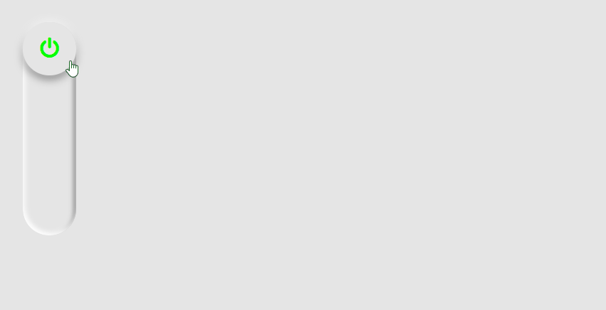
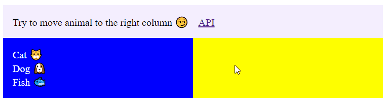
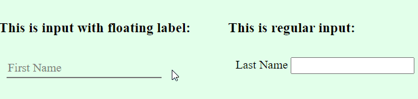
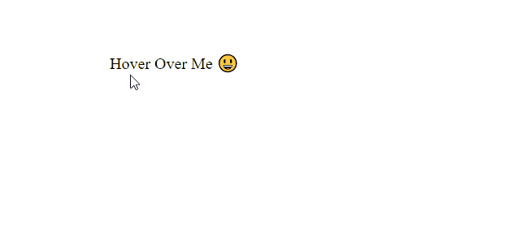

# Practicing HTML, CSS and JavaScript by Examples

### For real-world apps we usually use libs/frameworks, ready-to-use components, etc.
### But sometimes it is more interesting to create something simple by hands 😁.

---

### 🕵 When I have time I like to play with HTML/CSS/JS. I will put my attempts in this project.

 

### Here are some examples of what is inside:

##

##

##

##

